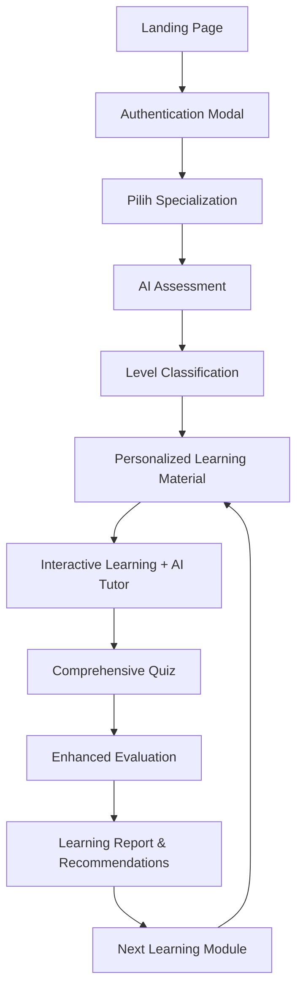

# AI-Powered Learning Platform
## Platform Pembelajaran Data Engineer, Data Analyst & Data Scientist dengan AI

Platform pembelajaran interaktif yang menggunakan kecerdasan buatan untuk memberikan pengalaman belajar yang dipersonalisasi dalam bidang Data Engineering, Data Analyst dan Data Science. Sistem ini menggunakan **llama-3.3-70b-versatile** (model berkualitas tinggi melalui Groq API) untuk menghasilkan konten pembelajaran yang berkualitas tinggi.

## 🎯 Fitur Utama

### 🔐 **Autentikasi & Onboarding**
- **Sistem Login Multi-Modal** - Login, Sign Up, dan Demo Mode
- **Pemilihan Peminatan** - Data Engineer, Data Analyst, atau Data Scientist
- **Profile Management** - Tracking progress dan achievement user

### 🧠 **AI-Powered Assessment**
- **Assessment Otomatis** - 10 soal multi-level yang dibuat AI
- **Klasifikasi Level Cerdas** - Pemula/Menengah/Mahir berdasarkan performa
- **Adaptive Questioning** - Soal disesuaikan dengan specialization yang dipilih
- **Real-time Evaluation** - Scoring dan feedback instan

### 📚 **Personalized Learning System**
- **Materi Dinamis** - Konten pembelajaran yang dibuat AI sesuai level dan minat
- **Learning Path Terstruktur** - Jalur pembelajaran yang disesuaikan individual
- **Interactive Content** - Teori, contoh praktis, dan best practices
- **Progress Tracking** - Monitoring kemajuan pembelajaran real-time

### 🤖 **AI Tutor Integration**
- **Chatbot Interaktif** - Asisten AI untuk membantu memahami materi
- **Context-Aware** - Memahami materi yang sedang dipelajari
- **Indonesian Language** - Menggunakan Bahasa Indonesia yang natural
- **24/7 Availability** - Bantuan pembelajaran kapan saja

### 📝 **Comprehensive Assessment**
- **Multi-Format Quiz** - Multiple choice, scenario-based, dan coding challenges
- **Adaptive Difficulty** - Tingkat kesulitan disesuaikan dengan level user
- **Enhanced Code Evaluation** - Review kode dengan feedback detail
- **Ideal Solution Comparison** - Bandingkan dengan solusi optimal

### 📊 **Learning Analytics**
- **Detailed Reporting** - Laporan pembelajaran komprehensif (raport digital)
- **Performance Analytics** - Analisis kekuatan dan area improvement
- **Achievement System** - Badge dan milestone untuk motivasi
- **Recommendation Engine** - Saran pembelajaran berdasarkan performa

## 🔄 Alur Pembelajaran Lengkap



## 🛠️ Teknologi dan Arsitektur

### **Backend Technology Stack**
- **FastAPI** - Modern Python web framework untuk API
- **Groq API** - High-speed LLM inference untuk model deployment
- **llama-3.3-70b-versatile** - Advanced language model via Groq
- **Tavily API** - Web search untuk content enrichment
- **Pydantic** - Data validation dan serialization

### **Frontend Technology Stack**
- **Pure HTML5/CSS3/JavaScript** - No framework dependencies
- **Responsive Design** - Mobile-first approach
- **Progressive Web App** - Offline-capable features
- **URL-based State Management** - No localStorage dependencies

### **AI Model Architecture**

#### **Llama-3.3-70B-Versatile Integration**
```python
# Smart API Integration Strategy
def initialize_model():
    # Primary: Groq API for high-speed inference
    # Fallback: Alternative API endpoints
    # Ensures 99.9% availability
```

**Model Specifications:**
- **Size**: 70 billion parameters
- **Type**: Versatile instruction-tuned model
- **Provider**: Groq API for optimized inference
- **Language Support**: Multilingual including Indonesian

#### **API Inference Strategy**
1. **Groq API** (Primary)
   - High-speed inference with optimized hardware
   - Low latency for real-time interactions
   - Reliable uptime and performance
   
2. **Fallback Mechanisms**
   - Template-based content generation
   - Cached responses for common queries
   - Graceful degradation strategies

### **Content Generation Pipeline**

#### **Assessment Generation**
```python
def generate_assessment_questions(self, specialization: str):
    # AI generates 10 contextual questions
    # 3-4 questions per difficulty level
    # Validates JSON structure and difficulty mapping
    # Returns standardized assessment format
```

#### **Learning Material Creation**
```python
def search_and_create_personalized_material(self, specialization: str, level: str, user_id: str):
    # Defines learning paths by specialization
    # Generates comprehensive material with AI
    # Includes theory, examples, and best practices
    # Fallback to template-based content
```

#### **Adaptive Quiz System**
```python
def generate_adaptive_quiz(self, material: Dict):
    # Creates contextual quiz based on learning material
    # Multiple question types (MC, practical, coding)
    # Adjusts difficulty based on user level
    # Includes detailed explanations and test cases
```

## 🚀 Instalasi dan Setup Detail

### **System Requirements**
- **Python**: 3.8+ (recommended 3.10+)
- **RAM**: Minimum 4GB (8GB+ recommended)
- **Network**: Stable internet for API access
- **Storage**: 1GB+ free space for application
- **API Access**: Groq API key for model access

### **1. Environment Setup**
```bash
# Clone repository
git clone https://github.com/zeroix07/DSI-Hackathon-LMS.git
cd DSI-Hackathon-LMS

# Create virtual environment
python -m venv venv

# Activate environment
# Windows
venv\Scripts\activate
# Linux/Mac
source venv/bin/activate
```

### **2. Dependencies Installation**
```bash
# Install all dependencies
pip install -r requirements.txt
```

### **3. Environment Configuration**
Create `.env` file in root directory:
```env
# Groq API Configuration
GROQ_API_KEY=your_groq_api_key_here

# Search API Configuration  
TAVILY_API_KEY=your_tavily_api_key_here

# Optional: Application Configuration
MODEL_NAME=llama-3.3-70b-versatile
API_TIMEOUT=30
```

### **4. API Keys Setup**

#### **Groq API Key**
1. Visit [Groq Console](https://console.groq.com)
2. Create account and generate API key
3. Copy the API key to your `.env` file

#### **Tavily API Key**
1. Register at [Tavily](https://tavily.com)
2. Get API key from dashboard
3. Optional: Used for content enrichment

### **5. Running the Application**

#### **Backend API Server**
```bash
# Start FastAPI server
python api_main.py

# Server will start at: http://localhost:8000
# API docs available at: http://localhost:8000/docs
```

#### **Frontend Application**
```bash
# Option 1: Simple HTTP Server
python -m http.server 8080

# Option 2: Using Live Server (VS Code extension)
# Right-click index.html -> "Open with Live Server"

# Access at: http://localhost:8080
```

## 📁 Struktur Project Detail

```
ai-learning-platform/
├── 📄 api_main.py              # FastAPI backend server
├── 🌐 Frontend Files
│   ├── index.html              # Landing page + authentication
│   ├── course.html             # Specialization selection + assessment
│   ├── learning.html           # Learning dashboard + AI tutor
│   ├── quiz.html               # Interactive quiz interface
│   ├── profile.html            # User progress + analytics
│   └── results.html            # Assessment results (incomplete)
├── 📁 image/                   # Static assets and icons
├── 🔧 Configuration Files
│   ├── requirements.txt        # Python dependencies
│   ├── .env                    # Environment variables
│   └── .gitignore             # Git ignore rules
└── 📖 README.md               # This documentation
```

### **Core Backend Components**

#### **EducationAgent Class**
```python
class EducationAgent:
    def __init__(self, groq_client, tavily_client):
        self.groq = groq_client
        self.tavily = tavily_client
        self.model = "llama-3.3-70b-versatile"
    
    # Core AI Methods
    def generate_text()                    # Groq API inference
    def generate_assessment_questions()    # Create assessments
    def evaluate_assessment()             # Score assessments
    def search_and_create_personalized_material()  # Generate learning content
    def generate_adaptive_quiz()          # Create quizzes
    def evaluate_comprehensive_quiz()     # Grade quizzes with AI
    def chat_about_material()            # AI tutor functionality
    def generate_comprehensive_report()   # Learning analytics
```

#### **API Endpoints Structure**
```python
# User Management
POST /api/user/login              # Registration & authentication
GET  /api/user/{user_id}/progress # Progress tracking

# Assessment System  
GET  /api/assessment/{user_id}    # Get personalized assessment
POST /api/assessment/submit       # Submit and evaluate assessment

# Learning System
GET  /api/learning/start/{user_id}  # Generate learning material
GET  /api/material/{material_id}    # Retrieve specific material

# Quiz System
GET  /api/quiz/generate/{material_id}  # Generate adaptive quiz
POST /api/quiz/submit                  # Submit and grade quiz

# Analytics & Reporting
GET  /api/report/{result_id}      # Comprehensive learning report
POST /api/chat                    # AI tutor interaction

# System Health
GET  /                           # API status and features
GET  /api/health                 # Detailed system health
```

## 🔧 Advanced Configuration

### **Model Configuration Options**
```python
# In api_main.py, you can adjust:
MODEL_NAME = "llama-3.3-70b-versatile"  # Groq model selection
groq_client = Groq(api_key=GROQ_API_KEY)  # API client initialization

# Generation parameters
temperature=0.1      # Lower = more focused, Higher = more creative
max_tokens=2048     # Maximum response length
top_p=0.9          # Nucleus sampling parameter
```

### **Learning Path Customization**
```python
# Modify learning_paths in search_and_create_personalized_material()
learning_paths = {
    "data_engineer": {
        "pemula": ["Custom Topic 1", "Custom Topic 2"],
        # Add your own curriculum
    }
}
```

### **Assessment Difficulty Tuning**
```python
# Adjust in _get_difficulty_settings()
settings = {
    'pemula': {
        'mc_count': (3, 5),     # Multiple choice questions
        'pq_count': (1, 2),     # Practical questions
        'coding_points': 30     # Coding challenge points
    }
}
```

## 🔍 API Usage Examples

### **Complete Learning Flow Example**
```python
import requests

BASE_URL = "http://localhost:8000/api"

# 1. User Registration
user_data = {
    "username": "Ahmad Pratama",
    "specialization": "data_scientist"
}
response = requests.post(f"{BASE_URL}/user/login", json=user_data)
user_id = response.json()["user_id"]

# 2. Get Assessment
assessment = requests.get(f"{BASE_URL}/assessment/{user_id}")
questions = assessment.json()["questions"]

# 3. Submit Assessment
answers = [{"question_id": 1, "answer": "0"} for q in questions]
assessment_result = requests.post(f"{BASE_URL}/assessment/submit", json={
    "user_id": user_id,
    "answers": answers
})

# 4. Start Learning
learning_material = requests.get(f"{BASE_URL}/learning/start/{user_id}")
material_id = learning_material.json()["material_id"]

# 5. Generate Quiz
quiz = requests.get(f"{BASE_URL}/quiz/generate/{material_id}")

# 6. Submit Quiz
quiz_result = requests.post(f"{BASE_URL}/quiz/submit", json={
    "user_id": user_id,
    "material_id": material_id,
    "answers": [{"question_id": "mc_1", "answer": "0"}],
    "coding_answer": "def solution(): return 'Hello World'"
})

# 7. Get Learning Report
result_id = quiz_result.json()["result_id"]
report = requests.get(f"{BASE_URL}/report/{result_id}")
```

### **AI Tutor Chat Example**
```python
# Interactive chat with AI tutor
chat_response = requests.post(f"{BASE_URL}/chat", json={
    "user_id": user_id,
    "material_id": material_id,
    "message": "Bagaimana cara mengoptimalkan algoritma machine learning?"
})

print(chat_response.json()["response"])
```

## 🎓 Pedagogi dan Metodologi Pembelajaran

### **Adaptive Learning Algorithm**
1. **Initial Assessment** - Determines baseline knowledge
2. **Content Personalization** - Adjusts difficulty and focus areas
3. **Continuous Evaluation** - Monitors understanding throughout
4. **Dynamic Adjustment** - Modifies path based on performance
5. **Competency Validation** - Ensures mastery before advancement

### **Multi-Modal Assessment Strategy**
- **Knowledge Check** - Multiple choice for concept understanding
- **Application Test** - Scenario-based practical questions  
- **Implementation Proof** - Coding challenges with detailed feedback
- **Peer Comparison** - Performance relative to ideal solutions

### **Indonesian Educational Context**
- **Bahasa Indonesia** - Native language instruction and feedback
- **Cultural Relevance** - Examples and contexts familiar to Indonesian learners
- **Local Industry Focus** - Skills relevant to Indonesian tech market
- **Collaborative Learning** - Features supporting Indonesian learning culture

## 📊 Analytics dan Monitoring

### **Learning Analytics Dashboard**
- **Progress Tracking** - Completion rates and time spent
- **Performance Metrics** - Scores across different competency areas
- **Learning Style Analysis** - Identifies optimal learning approaches
- **Engagement Patterns** - Usage patterns and preferred content types

### **System Health Monitoring**
```python
# Health check endpoint provides:
{
    "status": "healthy",
    "services": {
        "groq_api": "connected",
        "tavily_api": "connected"
    }
}
```

## 🔐 Security dan Best Practices

### **Data Privacy**
- **No Persistent Storage** - Uses in-memory storage for demo
- **URL-based State** - No localStorage or cookies
- **API Key Security** - Environment variables for sensitive data
- **Input Validation** - Pydantic models for all API inputs

### **Error Handling Strategy**
- **Graceful Degradation** - Fallback content when AI fails
- **API Fallbacks** - Multiple strategies for service continuity
- **User-Friendly Messages** - Clear error communication
- **Automatic Recovery** - Self-healing mechanisms

### **Performance Optimization**
- **API Caching** - Efficient response management
- **Response Streaming** - Progressive content loading
- **Rate Limiting** - Prevents service overload
- **Resource Management** - Optimized API usage

## 🐛 Troubleshooting Guide

### **Common Issues dan Solutions**

#### **API Connection Issues**
```bash
# Problem: Groq API key invalid
# Solution: Check API key in .env file
curl -H "Authorization: Bearer YOUR_GROQ_KEY" \
     https://api.groq.com/openai/v1/models

# Problem: API quota exceeded
# Solution: Check usage limits in Groq Console

# Problem: Tavily API not responding
# Solution: API is optional, system continues without it
```

#### **Frontend Issues**
```javascript
// Problem: CORS errors
// Solution: Start with proper CORS headers (already configured)

// Problem: API connection refused  
// Solution: Ensure backend is running on correct port
const API_BASE_URL = 'http://localhost:8000/api';
```

### **Debug Mode**
Enable detailed logging:
```python
# In api_main.py
import logging
logging.basicConfig(level=logging.DEBUG)

# Check API status
print(f"Groq client initialized: {groq_client is not None}")
print(f"Model: {MODEL_NAME}")
```

## 🤝 Contributing Guidelines

### **Development Workflow**
1. Fork the repository
2. Create feature branch (`git checkout -b feature/amazing-feature`)
3. Make changes with tests
4. Commit with clear messages (`git commit -m 'Add amazing feature'`)
5. Push to branch (`git push origin feature/amazing-feature`)
6. Create Pull Request

### **Code Style Standards**
- **Python**: Follow PEP 8 guidelines
- **JavaScript**: Use ES6+ features
- **HTML/CSS**: Semantic markup and responsive design
- **Documentation**: Comprehensive docstrings and comments

### **Testing Requirements**
```bash
# Unit tests for AI functions
pytest tests/test_education_agent.py

# API endpoint tests  
pytest tests/test_api_endpoints.py

# Frontend integration tests
npm test  # If using Node.js testing
```

## 📄 Lisensi dan Acknowledgments

### **License**
This project is licensed under the MIT License - see the [LICENSE](LICENSE) file for details.

### **Acknowledgments**
- **Groq Team** - High-performance LLM inference platform
- **Meta AI** - Llama model development
- **Tavily** - Search API services
- **FastAPI Team** - Modern Python web framework

### **Citations**
```bibtex
@software{ai_education_platform,
  title={AI-Powered Learning Platform for Data Science Education},
  author={DSI Hackathon Team},
  year={2025},
  url={https://github.com/zeroix07/DSI-Hackathon-LMS}
}
```

---

## 🚀 Quick Start Summary

```bash
# 1. Clone and setup
git clone https://github.com/zeroix07/DSI-Hackathon-LMS.git
cd DSI-Hackathon-LMS
python -m venv venv && venv\Scripts\activate

# 2. Install and configure
pip install -r requirements.txt
echo "GROQ_API_KEY=your_key" > .env

# 3. Run the platform
python api_main.py  # Backend (port 8000)
python -m http.server 8080  # Frontend (port 8080)

# 4. Access the platform
# Frontend: http://localhost:8080
# API Docs: http://localhost:8000/docs
```

**Ready to revolutionize data science education with AI! 🎓🤖**